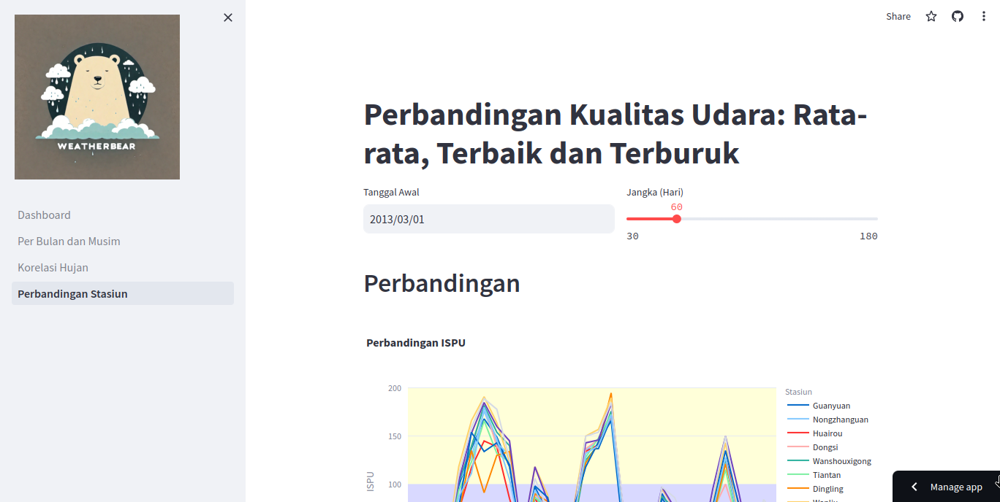

## Environment Setup
`pipenv install`
`pipenv shell`

## Running Streamlit
`streamlit run dashboard/Dashboard.py`

## External Link
Streamlit Cloud: [Link](https://mzpsh-sub-proyek-analisis-data-dashboarddashboard-k04dlh.streamlit.app/)
